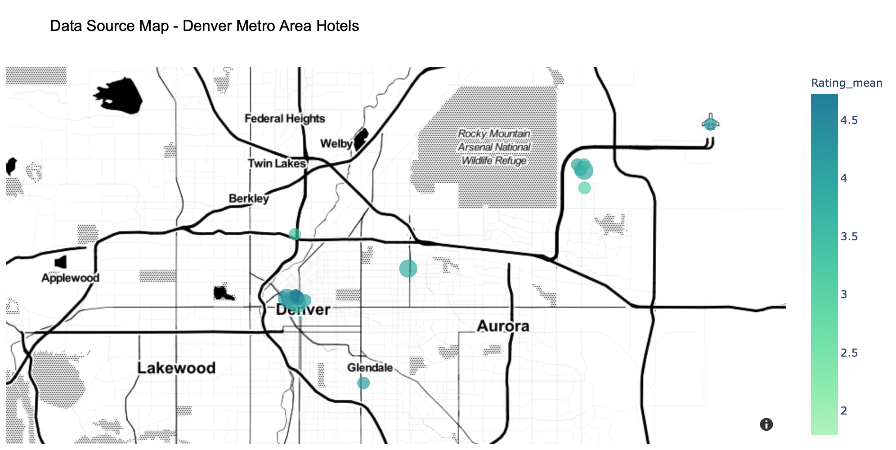
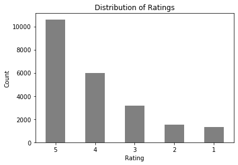
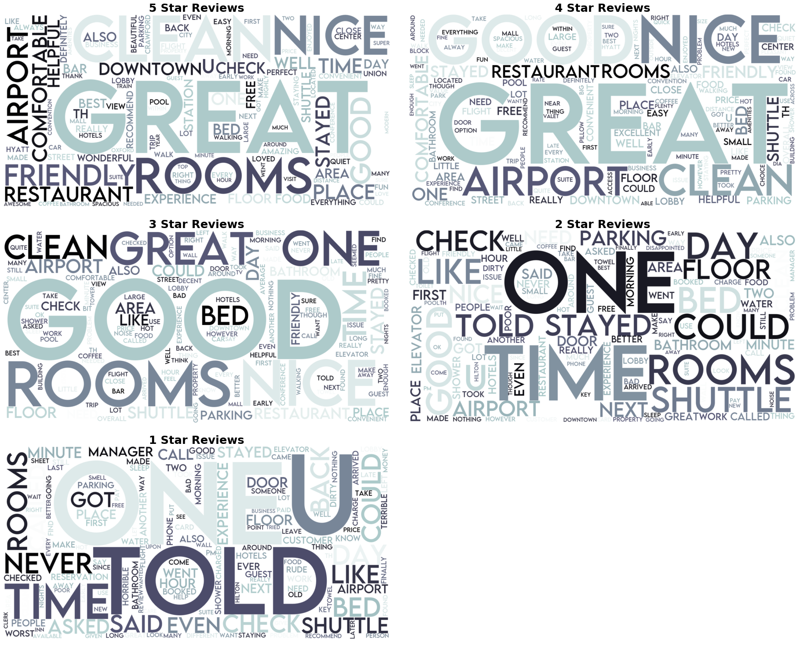
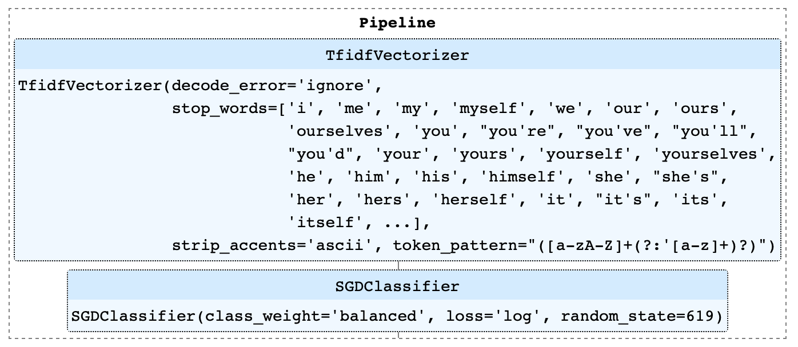
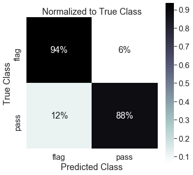
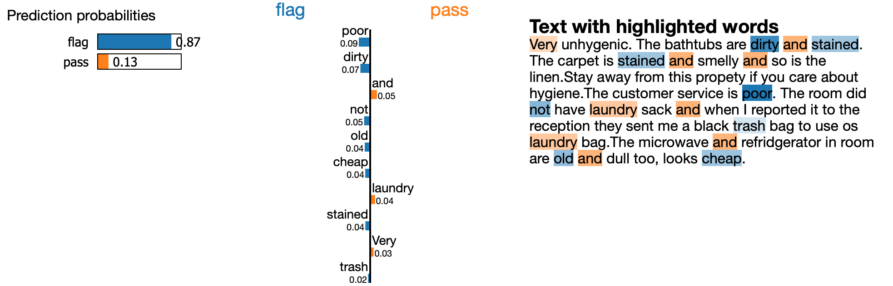

Anna D'Angela

Flatiron Data Science Program

Module 5 Project - Capstone

January 22nd, 2021

---

# Hotel Review Sentiment Classifier

*Natural Language Processing (NLP) - Communication Management Tool*

 
 
---

### Overview

Stakeholder: A company building a filter for hotel email/social media feeds to recognize low sentiment/upset customers to flag and bring to staff attention. 

End user: Hotel/hospitality industry

Business problem: Customer retention

Business solutions:
1) Brand management: Word of mouth reputation is just as important as published reviews. Filter aims to be part of a tool to scan Twitter, Facebook, etc. for mentions of the property and flag negative messages for staff to address.
2) Email filter: Flag emails containing negative hotel sentiment/issues and for urgent attention from staff. 

---

## Methodology

### Skills Demonstrated

- Webscraping: BeautifulSoup, Selenium
- EDA: Pandas, Plotly, World Cloud, 
- NLP: NLTK, LIME
- Classification: Sci-Kit Learn pipelines - Logistic Regression, Naive Bayes, Stochastic Gradient Descent

### Data

*Source/size/scope:*

Trip Advisor hotel review web scrape to gather 22,563 reviews from 24 hotels in the Denver metro-area. See hotel list [hotel](./data/coordinates.csv). Reviews gathered provide a user submitted text review with a labeled sentiment score between 1 (worst) and 5 (best). The gathered reviews heavily favored positive ratings (as expected for the hospitality industry, negative experiences are typically edge cases).

*Limitations:*

Proof of concept focused on Denver metro-area to keep the sites/attractions mentioned consistent. The scoring metric is entirely up to the user. Therefore, one person's 3 could be another person's 2 or 4.



###### Data Files
```
clean_scrape.csv        # final, cleaned, combined scrapes
denver_urls.txt         # list to URLs to scrape
coordinates.csv         # coordinate data for scraped hotels

scrape_3.csv            # 1200 from URL 4
scrape_4.csv            # 2000 from URL 5 - 6
scrape_5.csv            # 3995 from URL 7 - 10
scrape_6.csv            # 3930 from URL 1 - 4
scrape_8.csv            # 3000 from url 11 - 13
scrape_9.csv            # 9995 from URL 14 - 18
scrape_10.csv           # 1196 from URL 18 - 25

detroit_test_urls.txt   # sample set of URLs used to build scrape function
test_data.csv           # resulting test data to build collection notebook
```

 


### Pre-Processing and Supervised Learning

#### NLP
- Removed accents, punctuation, stop words, numbers and 'noise'
- 'Noise' were words appearing most frequently across all classes, thus providing no real signal
- Lowercase and lemmatize words into tokens



#### Vectorizer
TF-IDF to calculate weighted term frequency by class to convert text to a term-document matrix. A text represented as a vector of numbers that the model/computer will be able to interpret as a 'bag of words'.

#### Supervised Learning 
*Logistic Regression Classifier with Stochastic Gradient Descent (SGD):*

SGDClassifer is actually named for its optimizer: Stochastic Gradient Descent. With SGD, the gradient is calculated one point at a time instead of all points, which makes training very efficient. The type of model is set via the loss function. Through a grid search, the optimal loss function was found to 'log', setting the classifier to a logistic regression model with SGD optimizer. SGD models work efficiently with sparse matrices (which would be the input from the vectorizer). This model type can assign class weights when set to 'balance'.

*Naive Bayes Classifiers - Multinomial (MNB), Complement (CNB):*

Bayes models are used often in text classification with the “Naive” assumption that the probability of observing a word is independent of each other. The result is that the “likelihood” is the product of the individual probabilities of seeing each word in each class. This works well with 'bag of words' models, as the model examines each word of a text. Class and sample weights were calculated to address imbalance of positive reviews vs. negatives. 

In complement Naive Bayes, it is the opposite. Instead of calculating the probability of an item belonging to a certain class,  the probability of the item belonging to all the classes is calculated. According to Sci-Kit Learn documentation, CNB regularly outperforms MNB (often by a considerable margin) on text classification 

*Model Fitting:*

Exploring different parameters and pre-processing the 5 class models seemed to hit a ceiling of **61%** accuracy. With five classes, random guessing would yield a 1/5 or 20% of guessing correctly. The confusion matrices for these models showed that signal for classes 1, 3 and 5 was strong. The model was having trouble separating the middle classes, 2 and 4. This could be due to gradient of the reviews not being standardized. Humans selected the rating number. Since my business need was to flag communication from unhappy customers and not to accurately predict a rating score - I explored reducing to ternary classes: *"great", "good",* and *"bad"*. 

Accuracy jumped up **14%** to **75%** using a ternary classification problem. I further reduced this to binary *"flag"* or *'pass'*. With scores of 1 or 2 getting a flag and 3 upward getting passed. Removing middle cases significantly improved model accuracy to **87-89%** and high ROC/AUC scores. 

#### Final Model Analysis / Conclusions

*Parameters:*

The final model was a TF-IDF Vectorizer and Logistic Regression SGD Classifier pipeline. The pipeline was trained using the binary version of the training set resulting in predictions of "flag" or "pass". Pipeline architecture:



*Performance:*

The final classifier reached **89.2%** overall testing accuracy. Recall for 'flag' reviews was **94%**, meaning only 6% of bad reviews were missed. **12%** of 'pass' reviews were incorrectly flagged. This would result in non-urgent customer retention issues being brought to attention. The drawback of this in cost of for staff time/labor can be determined by the user. The weighted F1 score for the model was **90%.** The ROC/AUC score was **0.91.** The ROC/AUC score tells how capable the model is of distinguishing between classes (with 1 being a perfect score).



*Prediction Explainer:*

Here is an example of the feature importances of the final model uses a sample review.



---

### Recommendations

1. Use the binary model as a 'Needs Urgent Attention/Handle with Care' communication flagger.
2. Use multi-class model to set an urgency (1 vs 2 vs 3), marking most negative sentiment for first attention.
3. Expand proof of concept to other user specific location (remove location specific vocabulary).

### Future Work

1. Try Scrapy for web scraping to increase speed of scrape.
2. Explore transfer learning with pre-trained NLP models.
3. Explore clustering/topic modeling to examine what connects ratings in this industry. Use the topics associated with negative reviews to help train the flagger to note communication with positive/neural sentiment, but a guest still needed immediate retention action.

--- 

### Thank you!

View my presentation [slideshow](/od05_presentation.pdf) and [blog](https://annadangela.medium.com/) for this project.

Connect with me on [LinkedIn](https://www.linkedin.com/in/anna-d-angela-216b01b2/) and [Twitter](https://twitter.com/_dangelaa)!

#### Repository Contents
```
├── README.md
├── .gitignore
├── data                    
├── images
├── models
├── capstone_functions
│   ├── NLP_functions.py         
│   ├── collection_functions.py       
│   └── __init__.py        
├── data_collection.ipynb
├── NLP_and_modeling.ipynb
└── mod05_presentation.pdf
